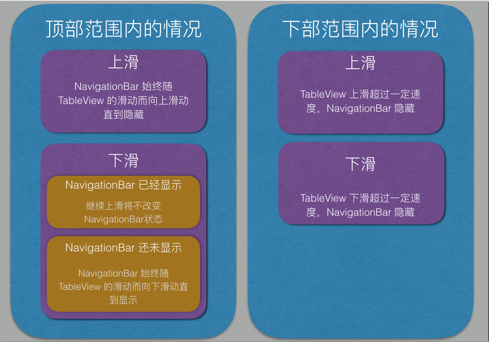
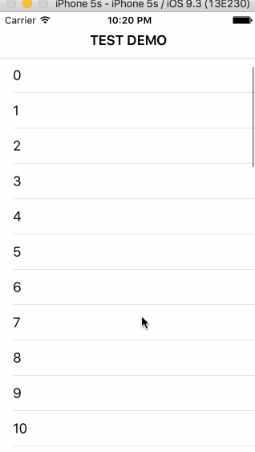

slide hide navigation bar 


最近在仿作知乎客户端，知乎首页的 navigationBar 会随着下方的 tableView 滑动而改变，上滑隐藏，下拉显示，并且下拉需要一定速度才会触发显示。在网上查了一下，看到一个随 TableView 滑动改变 NavigationBar 透明度的demo，虽然和自己的需求不一样，但提供了利用 KVO 实现的思路，有了思路就着手做了，调试了几次和知乎官方实现效果稍有不同，但基本需求实现了，如果需要做到完全相同，只要再加一些条件判断就好了，主要代码如下：

```objective-c
#import "TestTableViewController.h"

@interface TestTableViewController ()
@end

@implementation TestTableViewController {
	BOOL _isHidding;
}

- (void)viewDidLoad {
	[super viewDidLoad];

	[self setupScrollHideNavigationBar];

	self.navigationItem.title = @"TEST DEMO";
}

- (void)didReceiveMemoryWarning {
[super didReceiveMemoryWarning];
// Dispose of any resources that can be recreated.
}

#pragma mark - Table view data source

- (NSInteger)numberOfSectionsInTableView:(UITableView *)tableView {
return 1;
}

- (NSInteger)tableView:(UITableView *)tableView numberOfRowsInSection:(NSInteger)section {
return 50;
}
- (UITableViewCell *)tableView:(UITableView *)tableView cellForRowAtIndexPath:(NSIndexPath *)indexPath {
UITableViewCell *cell = [tableView dequeueReusableCellWithIdentifier:@"cell"];
if (!cell) {
    cell = [[UITableViewCell alloc]initWithStyle:UITableViewCellStyleDefault reuseIdentifier:@"cell"];
}
cell.textLabel.text = [NSString stringWithFormat:@"%d",(int)indexPath.row];

return cell;
}

#pragma mark - 上拉隐藏navigation bar
- (void)setupScrollHideNavigationBar {
//    self.tableView.contentOffset
[self.tableView addObserver:self forKeyPath:@"contentOffset" options:NSKeyValueObservingOptionOld|NSKeyValueObservingOptionNew context:nil];
}
- (void)removeScrollHideNavigationBar {
//remove
[self.tableView removeObserver:self forKeyPath:@"contentOffset"];
}
#pragma mark KVO
- (void)observeValueForKeyPath:(NSString *)keyPath ofObject:(id)object change:(NSDictionary<NSString *,id> *)change context:(void *)context {
if ([object isEqual:self.tableView] && [keyPath isEqualToString:@"contentOffset"]) {
    CGFloat newY = [change[@"new"] CGPointValue].y;
    CGFloat oldY = [change[@"old"] CGPointValue].y;
    float i = newY - oldY;       //i>0上滑， i<0下滑
    if (self.tableView.contentOffset.y>-64&&self.tableView.contentOffset.y<=24) {//边界条件，此处不精确
        if (i<=0&&_isHidding == NO&&self.navigationController.navigationBar.frame.origin.y==20) {    //下拉＋bar 已经显示的状态，不再移动
            return;
        }
        _isHidding = NO;
        self.navigationController.navigationBar.frame = CGRectMake(0, -44-self.tableView.contentOffset.y, 320, 44);
    }else if (self.tableView.contentOffset.y > 24) {
        
        if (i>10) {//更改数值大小可以控制触发 navigation bar 的滑动速度
            _isHidding = YES;
        }else if(i<-10) {
            _isHidding = NO;
        }else {
            
        }
    }
    [self.navigationController setNavigationBarHidden:_isHidding animated:YES];
  }
}
```

代码很简单就不详解了，附上各种情况的判断（上滑指手指上滑）：


最终效果只在一种情况和知乎客户端不一样，就是上图左下角的情况。

最终效果：

 


其他：当NavigationController 需要 push/pop ViewController 的时候注意需要取消KVO，否则在其他界面可能会出现 NavigationBar 隐藏的情况。

参考：
[1] iOS 实现ScrollView 上滑隐藏Navigationbar,下滑显示
[2] 设置navigationbar和statusBar的颜色透明

